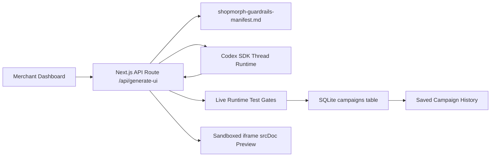
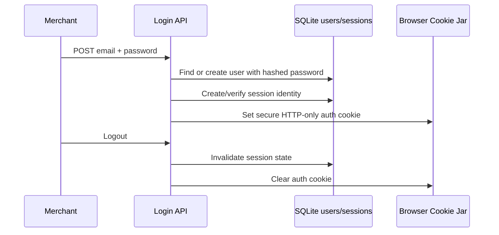

# ShopMorph Studio Architecture

## System Architecture Overview

ShopMorph Studio is a headless, decoupled AI application builder composed of three primary runtime layers:

| Layer | Responsibility | Key Files |
| --- | --- | --- |
| Next.js App Router | Hosts the dashboard UI, API route handlers, authentication flow, and iframe preview surface. | `src/app/dashboard/page.tsx`, `src/app/api/generate-ui/route.ts` |
| SQLite Persistence | Stores users, sessions, saved campaigns, generated raw HTML, and interactive widget code. | `src/lib/db.ts`, `shopmorph.sqlite` |
| OpenAI Codex SDK Runtime | Runs a local Codex thread loop that generates self-contained interactive HTML widgets from merchant prompts. | `@openai/codex-sdk`, `src/app/api/generate-ui/route.ts` |

The system separates execution responsibilities cleanly:



The browser never speaks directly to Codex or SQLite. The dashboard submits a plain marketing prompt to the App Router API. The backend constructs the AI context, runs Codex, validates the returned artifact, persists it, and returns only the safe execution payload and diagnostics needed by the client.

## Login / Authorization for Users

ShopMorph Studio uses a server-owned authentication boundary. The login flow is handled by App Router API and server helpers, while the client dashboard only receives the authenticated application surface.

| Concern | Implementation | Purpose |
| --- | --- | --- |
| Credential intake | `src/app/api/auth/login/route.ts` accepts `email` and `password` over `POST`. | Keeps credential handling on the server. |
| Password storage | Passwords are hashed before persistence. | Prevents plaintext credential storage. |
| Test-friendly onboarding | Unknown emails can be auto-created with a hashed password during evaluator flows. | Allows clean demo setup without manual account seeding. |
| Session transport | A secure, HTTP-only cookie identifies the authenticated user/session. | Prevents client-side JavaScript from reading auth cookies. |
| Logout | The logout path clears the active session cookie and invalidates server-side session state where applicable. | Ensures users can explicitly end access. |

The authorization model is intentionally lightweight for the current studio prototype: an authenticated merchant can access the dashboard, generate widgets, and reload saved campaigns. The browser does not directly control user IDs or database writes. API routes own the trusted state transitions, which keeps future role-based authorization straightforward to add.



## Data Persistence

SQLite is the local source of truth for ShopMorph Studio. The database layer initializes and migrates tables at application startup so the workspace remains easy to clone, run, and evaluate.

| Table | Stored Data | Used By |
| --- | --- | --- |
| `users` | Merchant email, display name, password hash, creation timestamp. | Login and account identity. |
| `sessions` | Session ID, linked user ID, expiration, creation timestamp. | Server-side session validation and logout. |
| `campaigns` | Original prompt, generated widget code, raw HTML fields, metadata, active state, creation timestamp. | Dashboard history, iframe reloads, future embed delivery. |

The generation API writes successful Codex artifacts only after runtime checks pass. This keeps persistence aligned with the safe execution gate:

```ts
const testLogs = runLiveUnitTests(interactiveWidgetCode, skillData);

const campaign = db.prepare(`
  INSERT INTO campaigns (prompt, raw_html, interactive_code, is_active)
  VALUES (?, ?, ?, 1)
`).run(prompt, interactiveWidgetCode, interactiveWidgetCode);
```

The dashboard then fetches previously saved records from the campaigns API and renders the history feed from persisted data instead of volatile React state. This gives merchants continuity across refreshes and creates the foundation for a production widget registry, publishing workflow, and analytics pipeline.

## The Manifest-Driven Prompt Pipeline

The generation pipeline is governed by an external markdown manifest:

```txt
shopmorph-guardrails-manifest.md
```

At request time, the API route reads the manifest using Node.js filesystem primitives:

```ts
const manifestPath = path.join(
  process.cwd(),
  "shopmorph-guardrails-manifest.md"
);
const guardrailsManifest = fs.readFileSync(manifestPath, "utf-8");
```

That raw markdown is injected into the Codex instruction context:

```ts
[
  "You are an expert Frontend Engineer...",
  "CRITICAL SYSTEM CONSTRAINTS...",
  guardrailsManifest,
  "Return your response strictly as a JSON object containing the `interactiveWidgetCode` key.",
  `User marketing widget request: ${prompt}`
].join("\n");
```

Pipeline steps:

1. The dashboard submits a merchant prompt to `/api/generate-ui`.
2. The API route reads `shopmorph-guardrails-manifest.md` from disk.
3. The route constructs a Codex thread prompt using the raw manifest as governance context.
4. Codex generates a JSON object with `interactiveWidgetCode`.
5. The backend validates, persists, and returns the generated widget.

This is superior to hardcoded string prompts because governance is decoupled from execution. Brand, layout, and security policy can evolve in markdown without rewriting orchestration code. The manifest becomes an auditable contract that product, design, and engineering can review independently.

## Stateful Tool Calling (Codex Skills)

ShopMorph includes a local programmatic skill named `getBrandGuardrails`.

```ts
function getBrandGuardrails(guardrailsManifest: string) {
  return JSON.stringify({
    manifest: guardrailsManifest,
    borderRadius: "rounded-xl",
    source: "shopmorph-guardrails-manifest.md"
  });
}
```

The tool definition is registered in the Codex run options:

```ts
const brandGuardrailsTool = {
  name: "getBrandGuardrails",
  description:
    "Fetches the current application design token constraints and brand-approved Tailwind utility classes.",
  parameters: {
    type: "object",
    additionalProperties: false,
    properties: {}
  }
};
```

The route uses a streamed execution loop to observe Codex events:

```ts
const streamedTurn = await thread.runStreamed(prompt, {
  outputSchema: uiSchema,
  tools: [brandGuardrailsTool]
});
```

When the stream reports a `getBrandGuardrails` tool call, the backend executes the local helper and continues the same thread with the tool result. This creates a stateful skill loop where Codex can ask the application for current design constraints before assembling the final widget.

| Stage | Actor | Result |
| --- | --- | --- |
| Tool registration | API route | Exposes `getBrandGuardrails` as a callable capability. |
| Tool request | Codex thread | Emits a tool-call event during streamed reasoning. |
| Tool execution | Next.js backend | Reads manifest-backed guardrails and serializes JSON. |
| Continuation | Codex thread | Uses returned guardrails as hard constraints for final output. |

## Live Runtime Testing & Safe Execution Gates

Before generated HTML reaches the frontend, the API route runs live structural assertions:

```ts
function runLiveUnitTests(htmlCode: string, skillData: any) {
  const testSuiteLogs: string[] = [];

  if (!htmlCode.includes("tailwindcss.com")) {
    throw new LiveUnitTestError("Tailwind CSS CDN wrapper is missing.");
  }

  if (!htmlCode.includes(skillData.borderRadius)) {
    throw new LiveUnitTestError("Required brand radius token is missing.");
  }

  if (!htmlCode.includes("<script>")) {
    throw new LiveUnitTestError("Inline interactive script tag is missing.");
  }

  return testSuiteLogs;
}
```

Each passing assertion prints a green diagnostic-style message to the Node console and is appended to `testLogs` for the client UI:

```txt
🧪 [LIVE RUNTIME TEST] ✓ Pass: Tailwind CSS CDN wrapper verified.
```

If any critical test fails, the API returns `422 Unprocessable Entity` instead of persisting or rendering the widget. This defensive pattern prevents malformed or incomplete AI artifacts from reaching the iframe execution surface.

| Gate | Purpose | Failure Mode |
| --- | --- | --- |
| Tailwind CDN check | Ensures generated UI styles correctly inside `srcDoc`. | `422` |
| Brand token check | Ensures manifest/skill constraints were applied. | `422` |
| Script tag check | Ensures interactive mechanics are actually executable. | `422` |

Successful responses include:

```json
{
  "id": 42,
  "interactiveWidgetCode": "<!doctype html>...",
  "generatedHtml": "<!doctype html>...",
  "testLogs": [
    "🧪 [LIVE RUNTIME TEST] ✓ Pass: Tailwind CSS CDN wrapper verified."
  ]
}
```

## Frontend Isolation Sandbox

AI-generated HTML and JavaScript are never injected directly into the dashboard DOM. Instead, the dashboard renders the widget inside an HTML5 iframe:

```tsx
<iframe
  srcDoc={componentData.interactiveWidgetCode}
  className="h-[700px] w-full rounded-xl border border-slate-800 bg-slate-950 shadow-2xl"
  sandbox="allow-scripts"
  title="Live interactive widget preview"
/>
```

The `srcDoc` attribute allows the app to execute a complete generated HTML page without creating a separate route or file. The `sandbox="allow-scripts"` policy permits the widget's inline JavaScript to run while blocking broader privileges such as top-level navigation, same-origin access, form submission, and direct access to the parent dashboard.

This isolation is critical because Codex can generate arbitrary HTML and JavaScript. The iframe boundary prevents:

| Risk | Mitigation |
| --- | --- |
| XSS against the dashboard | Generated script executes in the iframe, not the parent React tree. |
| CSS contamination | Tailwind CDN and generated styles are scoped to iframe document rendering. |
| Layout breakage | Widget dimensions are constrained by the canvas iframe. |
| Parent state access | No `allow-same-origin` or broad sandbox permissions are granted. |

The result is a controlled execution lab: Codex can produce rich, interactive conversion widgets, while the master ShopMorph dashboard remains stable, auditable, and protected.
